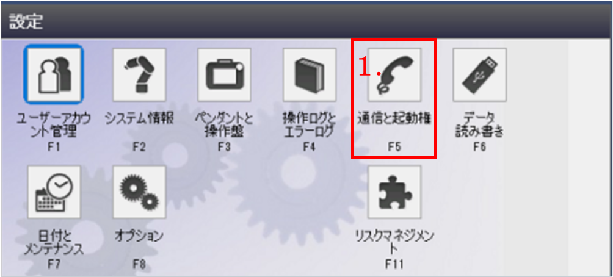
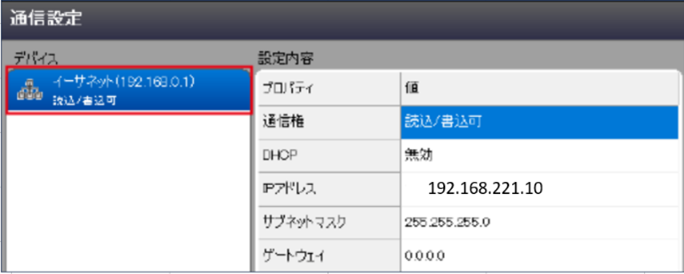
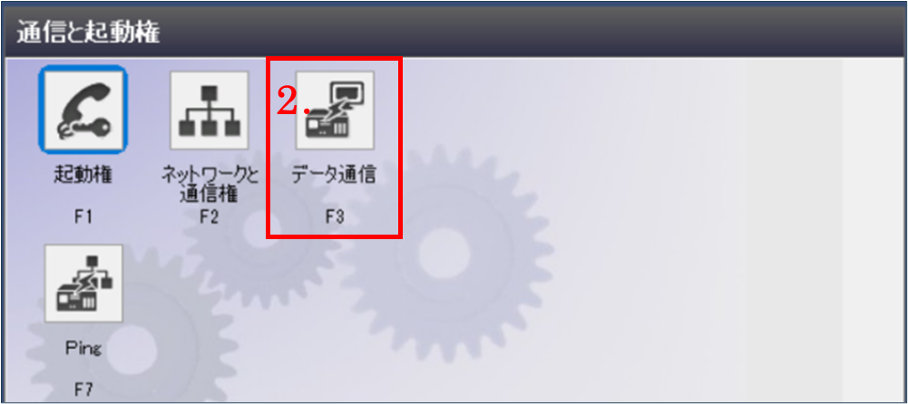
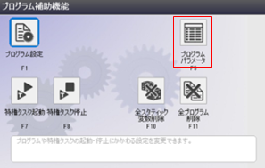
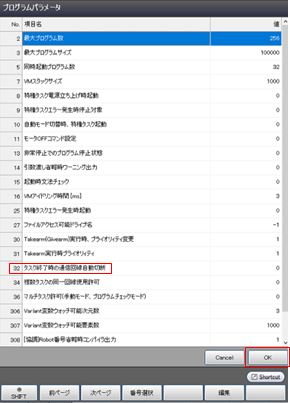
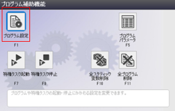
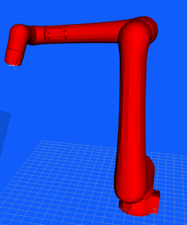

| VTチュートリアル ロボット接続編(DENSO) | Revision      | 第1版 |
| -------------------------------------- | ------------- | ----- |
| 作成者                                 | 株式会社YOODS |       |
| 作成日                                 | 2024年3月25日 |       |
| 最終更新日                             | 2024年3月25日 |       |

# 7. データ通信設定 ( DENSO )

|  No  | 手順                                                                                                                                                                                                                                                                                                                                                                                                                 | 補足                                                                                                                                                                    |
| :--: | -------------------------------------------------------------------------------------------------------------------------------------------------------------------------------------------------------------------------------------------------------------------------------------------------------------------------------------------------------------------------------------------------------------------- | ----------------------------------------------------------------------------------------------------------------------------------------------------------------------- |
| A140 | ロボットのIPアドレスを設定します。    初期画面の下部 「 設定 」 メニューから　　　　　　　　　　　　　　 下記の順で選択してください。     １．「 通信と起動権 」      ２．「 ネットワークと通信権 」  　　　　　　　　　　　　　                                                                                                                                               |                                                        |
| A141 | イーサネットを選択、下記項目を設定。   通     信     権：読込/書込可  D　H　C　P：無効  IP   アドレス：192.168.221.10  サブネットマスク：255.255.255.0                                                                                                                                                                                                                   |  ※IPアドレスはデフォルト値です。                                                                            |
| A142 | データ通信設定を行います。    初期画面の下部 「 設定 」 メニューから  下記の順で選択してください。   １．「 通信と起動権 」    ２．「 データ通信 」                                                                                                                                                                                                                               |                                                                                                              |
| A143 | デバイス：イーサネットを選択 サーバ回線の設定を行います。 「サーバ回線番号４」を選択、右記項目を設定。　　　　　　 　　                                                                                                                                                                                                                                                                               | T C P / U D P：TCP ポ 　 ー　 ト：50000 データタイプ：テキスト デリミタ：LF                                                                              |
| A144 | デバイス：イーサネットを選択 クライアント回線の設定を行います。 「クライアント回線15」を選択、右記項目を設定。              　　　　　　　　　　　　　　　  ※IPアドレスはデフォルト値です。 　クライアント回線で設定するIPアドレスは　　　　　　　　　　　　　　　　　　　　　　　 　PCのIPアドレスです。 　チュートリアルA1-ロボット接続A114を 　参照してください。 | TCP/UDP：TCP  IPｱﾄﾞﾚｽ：192.168.221.2  ポ　  ー　  ト：8888  データタイプ：テキスト  デリミタ：LF  ヘッダ：なし |

# 8.プログラムのロード ( DENSO )

|      | 手順                                                                                                                                                                                                                                                                                                                                              | 補足                                                                                                                                                                                                                                                                                                                                                                              |
| ---- | ------------------------------------------------------------------------------------------------------------------------------------------------------------------------------------------------------------------------------------------------------------------------------------------------------------------------------------------------- | --------------------------------------------------------------------------------------------------------------------------------------------------------------------------------------------------------------------------------------------------------------------------------------------------------------------------------------------------------------------------------- |
| A150 | PCデスクトップ「VTマニュアル」のリンクを選択して ダブルクリックしてください。  　　　　　　　　　　　　　　　　　　　　　　　　　　　　　　　　　　　　　　　　　　　　　　　　　　　   使用するロボットメーカーのフォルダを開き  「Robot_program」のフォルダを開いてください。                               | ※ロボットコントローラとWINCAPSが接続、使用 出来る環境をご準備ください。                                                                                                                                                                                                   |
| A151 | PCへUSBメモリを挿してください。    robot_programフォルダ内の  プログラムファイルを全てUSBへ  コピーしてください。    コピー完了後、USBを抜いてください。                                                                                                                                                            | USBメモリフォルダは自動で出てきますが 出ない場合、ファイルマネージャーを開いて  デバイス内のUSBフォルダを開いてください。    USBを抜く際は、ファイルマネージャー左側メニュー     デバイス内にあるUSBの  マークを押してから抜いてください。                                                    |
| A152 | WINCAPSを使用しているPCへ コピーしたプログラムファイルを移行し  WINCAPSの画面から  コピーしたプログラムをインポートしてください。    インポート後、右記のプログラムを  ロボットへ送信してください。   プログラムはルートフォルダに置いてください。                                                   | プログラム ●VTSample.pcs ●VTMove.pcs ●rovi.pcs ●RCalib.pcs ●RCalibAuto.pcs ●tsr0011.pcs                                                                                                                                                                                                                                                       |
| A153 | 操作盤パネルプログラムを使用すると TPから撮影等が実行できます。 ご使用の 「Main.pns9」 から 「rovi_panel.pns9」 を呼び出すように 変更してください。                                                                                                                                                                           | 操作盤パネルプログラム ●rovi_panel.pns9                                                                                                                                                                                                                                                                                                                                     |
| A154 | WINCAPSのPanelDesignerで 「Main.pns9」へ右記コマンドを追加してください。                                                                                                                                                                                                                                                                     | プッシュボタンを追加する場合  Sub PB1_CLICKED()         PageChange rovi_panel End Sub                                                                                                                                                                                                                                                                   |

# 9. 特権タスク設定 ( DENSO )

|  No  | 手順                                                                                                                                                                                                                                                                                           | 補足                                                                                                                                                                                                                                                                                                                                                                                         |
| :--: | :--------------------------------------------------------------------------------------------------------------------------------------------------------------------------------------------------------------------------------------------------------------------------------------------- | -------------------------------------------------------------------------------------------------------------------------------------------------------------------------------------------------------------------------------------------------------------------------------------------------------------------------------------------------------------------------------------------- |
| A160 | PCへロボットの現在値（軸値）を 送信するため特権タスクを実行させます。             　　　　　　　　　　　　　　　　　　　　　　　　　　　　　　　　                                    特権タスクで使用しているプログラムは  「tsr0011.pcs」 です。 | ※VTの機能を使用する時は 　特権タスクが起動されている事を確認してください。                                                                                                                                                             　　　　　　　　　　　　　　　　　　　　　　　　　　　　　　　　 |
| A161 | 初期画面の下部 「 プログラム 」 メニューを選択    下部　「　補助機能　」　を選択し、  プログラム補助機能画面を開いてください。     「　プログラムパラメータ　」を選択してください。                                                                                   |                                                                                                                                                                                                                                                                                                                                        |
| A162 | 項目名 「32.タスク終了時の通信回線自動切断」を  選択し、編集を押してください。     「有効　１」 に設定後、プログラムパラメータ画面  下部 「OK」 ボタンを押して  設定を完了させてください。                                                                       |                                                                                                                                                                                                                                                                                                                                        |
| A163 | 初期画面の下部 「 プログラム 」 メニューを選択    下部 「 補助機能 」 を選択し、  プログラム補助機能画面を開いてください。     「 プログラム設定 」を選択してください。                                                                                               |                                                                                                                                                                                                                                                                                                                                        |
| A164 | プログラム設定画面の上部 「 特権タスク 」 を選択してください。    下記、表の設定を行ってください。                                                                                                                                                                              |                                                                                                                                                                                                                                                                                                                                                                                              |

| **項目**                                                | **設定内容**                                 |
| ------------------------------------------------------------- | -------------------------------------------------- |
| 1. 電源立ち上げ時の起動設定                                   | ルートのみ起動                                     |
| 2. 電源立ち上げ時にエラー発生した場合の起動設定          | 起動する                                           |
| 3. 自動モード切替時の起動設定                                 | ルートのみ起動                                     |
| 4. 電源エラー発生時の停止対象                                 | 全特権タスク                                       |
| 5. 特権タスク実行中のI/O出力設定                              | 任意（特権タスク起動中を監視したい場合はONに設定） |

| A165 | 特権タスクはプログラム保存の操作を 行うと停止されます。                                                                               停止後は、再度特権タスクを起動してください。       |                                                                                                                                                                                                                                                                                              |
| :--- | :------------------------------------------------------------------------------------------------------------------------------------------------------------------------------------------------------------------------------------------------ | --------------------------------------------------------------------------------------------------------------------------------------------------------------------------------------------------------------------------------------------------------------------------------------------------------------------------------------------------------------------------------------------------------------------------------------------------------- |
| A166 | 特権タスク停止状態でPCから 撮影を実行すると、ロボットからの軸値送信が  できていないため 「901」 エラーが  発生します。     エラー発生時は特権タスクを起動してください。                                                  |                                                                                                                                                                                                                                                                                                                                                                                                                                                           |

# 10. 動作確認

|  No  | 手順                                                                                                                                                                                                                                                                                   |                                                                                                                                                                                                                     補足                                                                                                                                                                                                                     |
| :--: | -------------------------------------------------------------------------------------------------------------------------------------------------------------------------------------------------------------------------------------------------------------------------------------- | :-------------------------------------------------------------------------------------------------------------------------------------------------------------------------------------------------------------------------------------------------------------------------------------------------------------------------------------------------------------------------------------------------------------------------------------------: |
| A170 | デスクトップのVT起動アイコンをダブルクリックして、　　　　　　　　　　　　　　　　　　　　　　　　　　　　　　　 ビジュアルコントローラを起動します。                                                     ※起動済みの場合は、念のため再起動 |                                           　　　　　　　　　　　　　　　　　　　　　　　　　　　　　　　　　　　　　　　　　　　　　　　　　　　　　　                                                                   VT起動アイコン |
| A171 | ご使用のロボットが画面に表示されることを 確認します。                                                                                                                                                                                                                             |                                                                                                                                                                          画面上にロボットが表示されます。                                                                                                                                                                         |
| A172 | TPでロボットを動かし、画面上のロボットと 実際のロボットの動きが連動していることを  確認してください。                                                                                                                                                                        |                                                                                                                                                                                    各軸座標系で6軸それぞれを動かし  連動しているか確認してください。                                                                                                                                                                                    |
| A173 | これで接続は全て完了です。                                                                                                                                                                                                                                                             |                                                                                                                                                                                                                                                                                                                                                                                                                                              |
