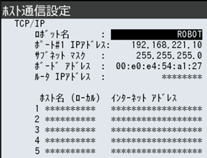
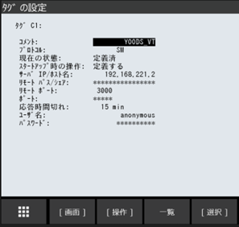
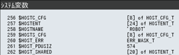
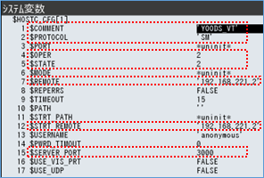
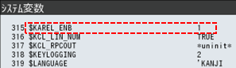
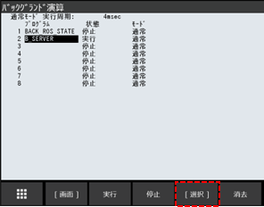
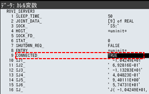
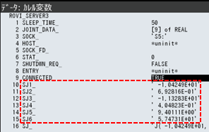
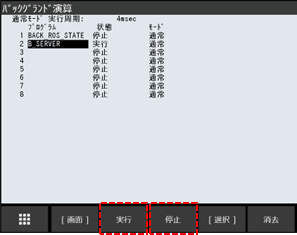
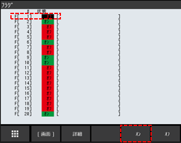

| VTチュートリアル ロボット接続編(FANUC) | Revision      | 第2版 |
| -------------------------------------- | ------------- | ----- |
| 作成者                                 | 株式会社YOODS |       |
| 作成日                                 | 2023年5月25日 |       |
| 最終更新日                             | 2024年2月29日 |       |

# 7.プログラムのロード ( FANUC )

| No   | 手順                                                                                                                                                                                          | 補足                                                                                                                                                                                                                                                                                                                                    |
| ---- | --------------------------------------------------------------------------------------------------------------------------------------------------------------------------------------------- | --------------------------------------------------------------------------------------------------------------------------------------------------------------------------------------------------------------------------------------------------------------------------------------------------------------------------------------- |
| A140 | PCデスクトップ「VTマニュアル」のリンクを選択して ダブルクリックしてください。     使用するロボットメーカーのフォルダを開き  「Robot_program」のフォルダを開いてください。 | ロボットへ必要なプログラムファイルを移行します。 TPプログラム  　●vt_main.tp  　●vt.move.tp  　●r_calib.tp  　●b_server.tp   PCプログラム  　●rovi_capture.pc  　●rovi_detect.pc  　●rovi_recipe.pc  　●rovi_reset.pc  　●rovi_solve.pc  　●rovi_serever3.pc |
| A141 | PCへUSBメモリを挿してください。    選択したフォルダ内のファイルを  全てUSBへコピーしてください。     コピー完了後、USBを抜いてください。                             | USBメモリフォルダは自動で出てきますが 出ない場合、ファイルマネージャーを開いて  デバイス内のUSBフォルダを開いてください。     USBを抜く際は、ファイルマネージャー左側メニュー デバイス内にあるUSBの マークを押してから抜いてください。         |
| A142 | TPへUSBメモリを挿して USB内のファイルを全てTPへロードしてください。  完了後、USBメモリを抜いてください。                                                                            | TPのUSB差し込み口は ロボットメーカー取扱い説明書を参照してください。                                                                                                                                                                                                                                                               |

# 8.TPでの通信設定 ( FANUC )

| No   | 手順                                                                                                                                                                                                                                              | 補足                                                                                                                                                  |
| ---- | ------------------------------------------------------------------------------------------------------------------------------------------------------------------------------------------------------------------------------------------------- | ----------------------------------------------------------------------------------------------------------------------------------------------------- |
| A150 | PCと通信するために ロボットIPアドレス等を設定していきます。                                                                                                                                                                                  | バージョンによって操作方法が違うので、 ロボット取扱い説明書を参照してください。                                                                  |
| A151 | TPの 「画面選択」 ボタンを押してください。 「設定」 メニューから 「ホスト通信」 を  選んでください。                                                                                                                                    |                                                                                                                                                       |
| A152 | 「表示」 を選択して 「プロトコル」 を選んでください。                                                                                                                                                                                        |                                                                                                                                                       |
| A153 | プロトコル設定の 「TCP/IP詳細設定」 を 選んでロボットIPアドレス、サブネットマスクを  入力してください。     ロボットIPアドレスを設定  　　　 例) 192.168.221.10  サブネットマスクを設定   　　　255.255.255.0 |                                                                                                 |
| A154 | 「前戻」 ボタンで前画面に戻り 「表示」 を選択して  「クライアント」 を選んでください。    ﾀｸﾞ1 C1:を選択して右記設定を  入力してください。                                                                            | ｺﾒﾝﾄ  : YOODS_VT ﾌﾟﾛﾄｺﾙ  : SM  ｽﾀｰﾄｱｯﾌﾟ時の操作 :定義する  IP/ﾎｽﾄ名 : 192.168.221.2  ﾘﾓｰﾄﾎﾟｰﾄ : 3000 |
|      | 入力後、 「操作」 ボタンを押して 「定義する」 を選択、実行してください。                                                                                                                   |                                                                                                 |
| A155 | 「前戻」 ボタンで前画面に戻り 「表示」 を選択して  「サーバ」 を選んでください。    ﾀｸﾞ5 S5:　を選択して右記設定を  入力してください。                                                                                | ｺﾒﾝﾄ  : YOODS_VT ﾌﾟﾛﾄｺﾙ  : SM  ｽﾀｰﾄｱｯﾌﾟ時の操作 :スタートする  応答時間切れ : 1 min                                  |
| A156 | 入力後、「操作」 ボタンを押して 「定義する」 → 「スタートする」 の順で  選択、実行してください。                                                                                                                                  |                                                                                                                                                       |

# 9.システム変数設定 ( FANUC )

| No   | 手順                                                                                                                                                                                                                           | 補足                                                   |
| ---- | ------------------------------------------------------------------------------------------------------------------------------------------------------------------------------------------------------------------------------ | ------------------------------------------------------ |
| A160 | TPの 「画面選択」 ボタンを押してください。 「システム」 メニューから 「システム変数」 を  選んでください。                                                                                                           |                                                        |
| A161 | 「$HOST**C** _CFG」 を選び  A154で選択したタグ番号を開いてください。  （ デフォルト：1 [1]）                                                                                                                   |  |
| A162 | A154で入力した内容が反映されているか 確認してください。  COMMENT : YOODS_VT  PROTOCOL  : SM  OPER : 2 (定義する)  STATE : 2 (定義済)  STRT_REMOTE : 192.168.221.2  $SERVER_PORT : 3000 |  |
| A163 | 「$KAREL_ENB」　を選び 「1」を 入力してください。                                                                                                                                                                         |  |

# 10.通信の実行と確認 ( FANUC )

| No   | 手順                                                                                                                                   | 補足                                                   |
| ---- | -------------------------------------------------------------------------------------------------------------------------------------- | ------------------------------------------------------ |
| A170 | TPの 「画面選択」 ボタンを押してください。 「設定」 メニューから 「バックグランド演算」 を  選んでください。                 |                                                        |
| A171 | 空いている番号にカーソルを合わせて 「選択」 ボタンを押してください。                                                              |  |
| A172 | 「プログラム」 の中から ロードしたプログラム「B_SERVER」 を 選択してください。                                               |                                                        |
| A173 | 設定ができたら 「実行」 を押した後、 電源再投入してください。  電源再投入後、プログラムが実行されているか  確認します。 | VTが起動、接続されている状態で ご確認ください。   |
| A174 | プログラム 「一覧」 ボタンを押して 「タイプ」 から 「カレル」 を選択してください。                                                |                                                        |

| A175 | ロードしたプログラム 「ROVI_SERVER3」 を 選択、「データ」 ボタンを押し  「画面」 ボタンから 「カレル変数」 を  選択してください。 |                                                        |
| ---- | :----------------------------------------------------------------------------------------------------------------------------------------------- | ------------------------------------------------------ |
| A176 | CONNECTED_の欄が 「TRUE」 に なっていれば通信ができている状態です。                                                                         |  |
| A177 | SJ1_～SJ6はロボット各軸の現在値です。 ロボットを動かして数値が変化するか  確認してください。                                           |  |

# 11.不具合時の復旧 ( FANUC )

| No   | 手順                                                                                                                                                                                      | 補足                                                                            |
| ---- | ----------------------------------------------------------------------------------------------------------------------------------------------------------------------------------------- | ------------------------------------------------------------------------------- |
| A180 | VTとの通信プログラム 「B_SERVER」 では 「フラグ」 を使用しています。     VTとの通信を行うためには  「B_SERVER」 実行中に 「フラグ１」 を  ONする必要があります。 | 電源投入時は自動的に 「B_SERVER」が実行され、 「フラグ１」 が ONされます。 |
|      |                                                                                                                                                                                           |                                                                                 |
| A181 | 運転中、ロボットプログラムが停止した場合は 以降の手順で復旧してください。                                                                                                            |                                                                                 |
| A182 | TPの 「画面選択」 ボタンを押してください。 「設定」 メニューから 「バックグランド演算」 を  選んでください。                                                                    |                                                                                 |
| A183 | 設定してある 「B_SERVER」 に カーソルを合わせ 「実行」 ボタンを押してください。    エラーが出ている場合は、一度 「停止」 を  押した後、「実行」 を押してください。    |                           |
| A184 | TPの 「画面選択」 ボタンを押してください。 「I/O」 メニューから 「フラグ」 を  選んでください。                                                                                 |                                                                                 |
| A185 | 「#1」 にカーソルを合わせて 「オン」 を  押してください。    「オン」 を押した後、すぐ自動的に  「オフ」 に切り替わります。                                           |                           |
| A186 | A174～A177の項目を確認して通信状態を 確認してください。                                                                                                                              |                                                                                 |

**改定履歴**

| #     | 日付          | 内容                                                          |
| ----- | ------------- | ------------------------------------------------------------- |
| 初版  | 2023年5月25日 |                                                               |
| 第2版 | 2024年2月29日 | 軸値送信対応 プログラム(ROVI_SERVER3 ,B_SERVER)、通信設定追加 |
