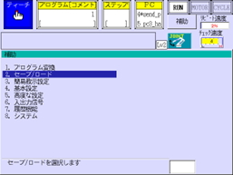
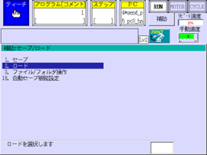
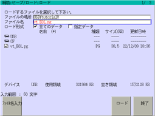
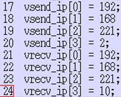
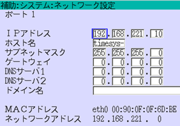
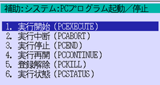
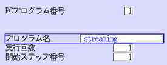
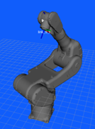
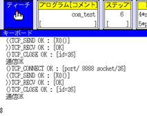

| VTチュートリアル ロボット接続編〜川崎重工業版 | Revision       | 第1版 |
| --------------------------------------------- | -------------- | ----- |
| 作成者                                        | 株式会社YOODS  |       |
| 作成日                                        | 2022年12月15日 |       |
| 最終更新日                                    | 2022年12月15日 |       |

# 7.プログラムのロード

| No   | 手順                                                                                                                                                                                                                             | 確認方法                                                  |
| ---- | -------------------------------------------------------------------------------------------------------------------------------------------------------------------------------------------------------------------------------- | --------------------------------------------------------- |
| A140 | PCデスクトップから「VTマニュアル（リンク）」を ダブルクリックしてください。  「Kawasaki」→「Robot_program」を開き  「vt_**.pg」 をUSBメモリに記録します。  (**はバージョン番号)  USBをTPに挿入します。 |                                                           |
| A141 | TPのメニューボタンを押し、補助機能を開きます。 2.セーブ/ロードを選択します。                                                                                                                                                |  |
| A142 | 2.ロードを選択します。                                                                                                                                                                                                           |  |
| A143 | vt_**.pg (**はバージョン番号)を選択して、 ロードします。                                                                                                                                                                    |  |

# 8.  ロボット通信の設定

| No   | 手順                                                                                                                                                                             | 確認方法                                                  |
| ---- | -------------------------------------------------------------------------------------------------------------------------------------------------------------------------------- | --------------------------------------------------------- |
| A150 | プログラムs3_vcom_initを開きます。 以下のパラメータを入力します。  vsend_ip : PCのIPアドレス  vrecv_ip :ロボット のIPアドレス                                     |  |
| A151 | プログラムs3_vcom_initを実行します。 通信プログラムの変数が更新されます。                                                                                                   |                                                           |
| A152 | ・ロボットIPアドレスの確認 「補助機能」→「システム」→「ネットワーク設定」を 選択してください。ロボットのIPアドレスが表示さ れるので、間違いがないか確認します。 |  |

# 9.

ロボット通信プログラムの起動

| No   | 手順                                                                                                                                                                                                                                                  | 確認方法                                                                                                                                                        |
| ---- | ----------------------------------------------------------------------------------------------------------------------------------------------------------------------------------------------------------------------------------------------------- | --------------------------------------------------------------------------------------------------------------------------------------------------------------- |
| A160 | 「補助機能」→「システム」→ 「PCプログラム起動／停止」を選択します。     実行開始PCEXECUTEを選択します。                                                                                                                              |                                                                                                        |
| A161 | 以下のように設定します。 PCプログラム番号:任意  プログラム名: streaming  実行回数: 1  開始ステップ番号: 1  ※設定するPCプログラム番号が既に実行されて いる場合は、事前にPCABORT等でプログラム を停止してください。 |                                                                                                        |
| A162 | PCプログラムが実行され、 *send_pos  が表示されます。                                                                                                                                                                                        |             |

# [10. ]()動作確認

| No   | 手順                                                                                                                                                                                                 | 確認方法                                                                                                                                                                                  |
| ---- | ---------------------------------------------------------------------------------------------------------------------------------------------------------------------------------------------------- | ----------------------------------------------------------------------------------------------------------------------------------------------------------------------------------------- |
| A170 | デスクトップのVT起動アイコンをダブルクリックして、 ビジュアルコントローラを起動します。  (※起動済みの場合は、念のため再起動  してください。)                                         |  VT起動アイコン                                                                                                             |
| A171 | ご使用のロボットが画面に表示されることを確認しま す。ティーチングペンダントを使ってロボットを動かし て、画面上のロボットと実際のロボットの動きが連動 していることを確認してください。 |   画面上にロボットが表示されます。 |
| A172 | ロボットプログラムcom_testを実行します。                                                                                                                                                             |                                                                                                                                                                                           |
| A173 | メニューボタンを押してキーボードを選択します。                                                                                                                                                       |                                              |
| A174 | 通信OKと表示されていることを確認します。                                                                                                                                                             |                                                                                                                                  |

**改定履歴**

| #    | 日付             | 内容 |
| ---- | ---------------- | ---- |
| 初版 | 2022年 12月 15日 |      |
