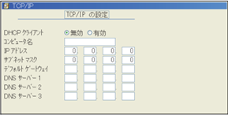
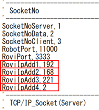
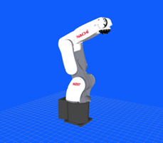

| VTチュートリアル ロボット接続編(NACHI) | Revision      | 第1版 |
| -------------------------------------- | ------------- | ----- |
| 作成者                                 | 株式会社YOODS |       |
| 作成日                                 | 2023年5月25日 |       |
| 最終更新日                             | 2023年5月25日 |       |

# 7.TPでのIPアドレス設定 (NACHI)

| No   | 手順                                                                                                                                                | 補足                                                                                                                                                    |
| ---- | --------------------------------------------------------------------------------------------------------------------------------------------------- | ------------------------------------------------------------------------------------------------------------------------------------------------------- |
| A140 | プロテクトレベルを 「ＥＸＰＥＲＴ」 にしてください。                                                                                           | RコードキーでRコード「314」を入力し プロテクトレベル変更を選択する。   デフォルト設定では何も入力せずEnterキーを 押すとプロテクトレベルが変更できます。 |
| A141 | TP画面の「定数設定」を選択し 「8.通信」→「2.イーサネット」→「1. TCP/IP」の 順に選択してください。                                       | 以下のメニューが表示されます。                                                               |
| A142 | ロボットのIPアドレス、サブネットマスクを  入力します。     入力が完了したら「書き込み」を選択して  入力内容を保存してください。 | DHCPクライアント:無効 例) IPアドレス 192.168.221.10 サブネットマスク 255.255.255.0   IPアドレス、サブネットマスク以外は 入力の必要はありません。        |
| A143 | 電源再投入をしてください。                                                                                                                          |                                                                                                                                                         |

# 8.

プログラムのロード ( NACHI )

|      | 手順                                                                                                                                                                   | 補足                                                                                                                                                                                                                                                     |
| ---- | ---------------------------------------------------------------------------------------------------------------------------------------------------------------------- | -------------------------------------------------------------------------------------------------------------------------------------------------------------------------------------------------------------------------------------------------------- |
| A150 | PCデスクトップ「VTマニュアル」のリンクを選択して ダブルクリックしてください。   使用するロボットメーカーのフォルダを開き 「Robot_program」のフォルダを開いてください。 | ロボットへ必要なプログラムファイルを移行します。   TPのUSB差し込み口は ロボットメーカー取扱い説明書を参照してください。                                                                                                                                  |
| A151 | PCへUSBメモリを挿してください。   選択したフォルダ内のファイルを 全てUSBへコピーしてください。   コピー完了後、USBを抜いてください。                                   | USBメモリフォルダは自動で出てきますが 出ない場合、ファイルマネージャーを開いて デバイス内のUSBフォルダを開いてください。   USBを抜く際は、ファイルマネージャー左側メニュー    デバイス内にあるUSBの マークを押してから抜いてください。                   |
| A152 | TPへUSBメモリを挿してください。 TP画面の「ファイル操作」を選択します。   USB内のファイルをTPへコピーしてください。   コピー完了後、USBメモリを抜いてください。         | 1. 1.コピー　を選択 2. 装置（元）でTP外部メモリを選択 3. 「→」キーで移動 4. TP外部メモリ内のPCからコピーしてきた ファイルを全て選択 5. 選択できたら「→」キーで移動していき 装置（先）が内部メモリの WORK\PROGRAMになっている事を確認 6. 「実行」を押す |

# 9.TPでのプログラム内IPアドレス設定 (NACHI)

| No   | 手順                                                                                                                                                                                                                                                                                | 補足                                                                                                       |
| ---- | ----------------------------------------------------------------------------------------------------------------------------------------------------------------------------------------------------------------------------------------------------------------------------------- | ---------------------------------------------------------------------------------------------------------- |
| A160 | TP画面の「サービス」を選択し 「15.アスキーファイル編集」を選択してください。                                                                                                                                                                                                   |                                                                                                            |
| A161 | 内部メモリ →PROGRAMを選択し、 PCからコピーしたファイル 「RoviIf.inc」 に  カーソルを合わせ「実行」を押してください。                                                                                                                                                     |                                                                                                            |
| A162 | 25～28行目がPCのIPアドレスを 入力する行になるので入力してください。    例)  PC IPアドレス192.168.221.2    25行目RoviIpAdd1,**192**  26行目RoviIpAdd2,**168**  27行目RoviIpAdd3,**221**  28行目RoviIpAdd4,**2** | ※A114で設定したIPアドレスを入力してください。  |
| A163 | 入力が完了したら「書き込み」を選択して 入力内容を保存してください。                                                                                                                                                                                                                 |                                                                                                            |

# 10.プログラムのコンパイルとユーザータスクの設定 ( NACHI )

|      | 手順                                                                                                                                                                                        | 補足                                                                                                                                                   |
| ---- | ------------------------------------------------------------------------------------------------------------------------------------------------------------------------------------------- | ------------------------------------------------------------------------------------------------------------------------------------------------------ |
| A170 | TP画面の「サービス」を選択してください。 「9.プログラム変換」→「8.言語変換」を  選択してください。                                                                               | プロテクトレベルは 「ＥＸＰＥＲＴ」 にしてください。                                                                                                   |
| A171 | 内部メモリにあるコピーしてきたファイルの中から 右記のファイルを全て選択してください。     変換種別が 言語形式→実行形式になっている事を  確認し、実行を押してください。 | ●USERTASK-A.000 ●USERTASK-A.100  ●USERTASK-A.101  ●USERTASK-A.102  ●USERTASK-A.103                                            |
| A172 | TP画面の「サービス」を選択してください。 「 モニタ 」 →「 ユーザータスク 」 →  「ユーザータスクモニタ」を選択してください。                                                     | モニタ画面は何番でも大丈夫です。                                                                                                             |
| A173 | 一番上の行 プログラム番号「0」の優先度を「３」に  変更してください。  変更後、「書き込み」を押してください。                                                                 | 編集キー  を押すと編集モードにできます。 数値入力後はEnterキーを押さないと 反映されません。 |
| A174 | 電源再投入してください。                                                                                                                                                                    |                                                                                                                                                        |
| A175 | もう一度「ユーザータスクモニタ」を開いて プログラム番号「０」が「起動中」になっている事を  確認してください。                                                                     |                                                                                                                                                        |
| A176 | A170同様に、言語変換を開いてください。                                                                                                                                                      |                                                                                                                                                        |
| A177 | 内部メモリにあるコピーしてきたファイルの中から 右記のファイルを選択してください。  変換種別が  言語形式→実行形式になっている事を  確認し、実行を押してください。       | ● USRPROC.inc                                                                                                                                         |
| A178 | これでコンパイルは作業は完了です。                                                                                                                                                          |                                                                                                                                                        |

# 11.動作確認

| No   | 手順                                                                                                                                  | 補足                                                                                                                                                                                           |
| ---- | ------------------------------------------------------------------------------------------------------------------------------------- | ---------------------------------------------------------------------------------------------------------------------------------------------------------------------------------------------- |
| A180 | デスクトップのVT起動アイコンをダブルクリックして、 ビジュアルコントローラを起動します。  ※起動済みの場合は、念のため再起動 | 　　　　　　　　　　　 　　　　　VT起動アイコン |
| A181 | ご使用のロボットが画面に表示されることを 確認します。                                                                            |  画面上にロボットが表示されます。                                                                                                   |
| A182 | TPでロボットを動かし、画面上のロボットと 実際のロボットの動きが連動していることを  確認してください。                       | 各軸座標系で6軸それぞれを動かし 連動しているか確認してください。                                                                                                                          |
| A183 | これで接続は全て完了です。                                                                                                            |                                                                                                                                                                                                |

**改定履歴**

| #    | 日付            | 内容 |
| ---- | --------------- | ---- |
| 初版 | 2023年 5月 25日 |      |
