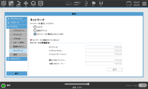
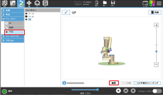
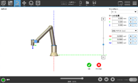
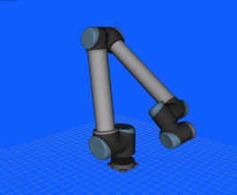

| VTチュートリアル ロボット接続編(UR) | Revision      | 第1版 |
| ----------------------------------- | ------------- | ----- |
| 作成者                              | 株式会社YOODS |       |
| 作成日                              | 2023年5月25日 |       |
| 最終更新日                          | 2023年5月25日 |       |

# 7.TPでのIPアドレス設定 (UR)

| No   | 手順                                                                                                                                                   | 補足                                                                                    |
| ---- | ------------------------------------------------------------------------------------------------------------------------------------------------------ | --------------------------------------------------------------------------------------- |
| A140 | 画面右上のメニューバーから                      を押してください。                             | PCと通信するために ロボットIPアドレスを設定します。                                |
| A141 | 「ロボットの設定」 を押してください。    「システム」→「ネットワーク」の順に  選択してください。                                       | 以下のメニューが表示されます。  |
| A142 | 1. 固定アドレスを選択 2. ロボットIPアドレスを設定  例)192.168.221.10  3. サブネットマスクを設定  255.255.255.0  4. 適用を押す |                                                                                         |
| A143 | 終了を押してください。                                                                                                                            |                                                                                         |

# 8.プログラムのロード ( UR )

| No   | 手順                                                                                                                                                                                          | 補足                                                                                                                                                                                                                                                                                                                                    |
| ---- | --------------------------------------------------------------------------------------------------------------------------------------------------------------------------------------------- | --------------------------------------------------------------------------------------------------------------------------------------------------------------------------------------------------------------------------------------------------------------------------------------------------------------------------------------- |
| A150 | PCデスクトップ「VTマニュアル」のリンクを選択して ダブルクリックしてください。     使用するロボットメーカーのフォルダを開き  「Robot_program」のフォルダを開いてください。 | ロボットへ必要なプログラムファイルを移行します。                                                                                                                                                                                                                                                                                        |
| A151 | PCへUSBメモリを挿してください。    選択したフォルダ内のファイルを  全てUSBへコピーしてください。     コピー完了後、USBを抜いてください。                             | USBメモリフォルダは自動で出てきますが 出ない場合、ファイルマネージャーを開いて  デバイス内のUSBフォルダを開いてください。    USBを抜く際は、ファイルマネージャー左側メニュー     デバイス内にあるUSBの  マークを押してから抜いてください。   |
| A152 | TPへUSBメモリを挿してください。    USB内のファイルを全てTPへコピーしてください。  コピー完了後、USBメモリを抜いてください。                                          | TPのUSB差し込み口は ロボットメーカー取扱い説明書を参照してください。                                                                                                                                                                                                                                                               |

# 9.変数設定 ( UR )

| No             | 手順                                                                           | 補足                                                                                                                      |
| -------------- | ------------------------------------------------------------------------------ | ------------------------------------------------------------------------------------------------------------------------- |
| A160           | TPへコピーしたプログラムから  「VT_MAIN」を選択して開いてください。  | プログラム 「VT_MAIN」 を開くと、  紐づいているプログラム 「default」 内の  変数設定が反映されます。       |
| A161           | 設置設定を選択し、  「全般」→「変数」を開いてください。                  | プログラムを開いた後に、  設定が正しく反映されているかを確認します。                                                 |
| A162           | 下記、表通りに設定されているか  確認してください。                        | TPメニューの 「説明」 欄は空白で大丈夫です。  設定が反映されていなければ  「名前」、「値」 を入力してください。 |
| 名前           | 値                                                                             | 備考                                                                                                                      |
| host           | "192.168.221.2"                                                                | PCのIPアドレス **※A114で設定したIPアドレス**                                                                  |
| port           | 3000                                                                           | PCのポート番号                                                                                                            |
| socket_name    | "vt"                                                                           | ROVI命令で通信するときのソケット名                                                                                        |
| socket_timeout | 5                                                                              | PCと通信するときのタイムアウト時間                                                                                        |
| rovi_err       | 0                                                                              | 処理結果(0=OK, 0以外=NG)                                                                                                  |
| is_popup       | True                                                                           | ポップアップメッセージ(True=する)                                                                                         |
| Y1             | [0.0, 0.0, 0.0, 0.0]                                                           | 撮影処理結果を格納                                                                                                        |
| Y2             | p[0.0, 0.0, 0.0, 0.0, 0.0, 0.0]                                                | 解析処理結果を格納  この値を平面フィーチャーに代入                                                                   |

# 10.フィーチャー設定 (UR)

| No   | 手順                                                                                                                                                                                             | 補足                                                                                    |
| ---- | ------------------------------------------------------------------------------------------------------------------------------------------------------------------------------------------------ | --------------------------------------------------------------------------------------- |
| A170 | 解析処理結果を基に 補正値を代入するユーザー座標を設定します。                                                                                                                               |                                                                                         |
| A171 | TPから「設置設定」→「フィーチャー」を 選択してください。     「平面」 を選択するとフィーチャーに  平面が追加されます。  追加された平面を選択し、編集を押してください。 | 以下のメニューが表示されます。  |
| A172 | ベース座標を選択し、数値は全て「0」のまま OKを押して登録してください。                                                                                                                      | 以下のメニューが表示されます。  |
| A173 | 登録した設定を選択し、  名前を「UF」に変更してください。                                                                                                                               | 名前を間違えると補正動作が出来ないので  注意してください。                         |

# 11.

動作確認

| No   | 手順                                                                                                                                  | 補足                                                                                                                                                                                                              |
| ---- | ------------------------------------------------------------------------------------------------------------------------------------- | ----------------------------------------------------------------------------------------------------------------------------------------------------------------------------------------------------------------- |
| A180 | デスクトップのVT起動アイコンをダブルクリックして、 ビジュアルコントローラを起動します。  ※起動済みの場合は、念のため再起動 |                                    VT起動アイコン |
| A181 | ご使用のロボットが画面に表示されることを 確認します。                                                                            |                                                                                                                                                                |
| A182 | TPでロボットを動かし、画面上のロボットと 実際のロボットの動きが連動していることを  確認してください。                       | 各軸座標系で6軸それぞれを動かし 連動しているか確認してください。                                                                                                                                             |
| A183 | これで接続は全て完了です。                                                                                                       |                                                                                                                                                                                                              |

**改定履歴**

| #    | 日付            | 内容 |
| ---- | --------------- | ---- |
| 初版 | 2023年 5月 25日 |      |
