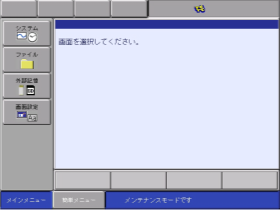
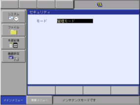
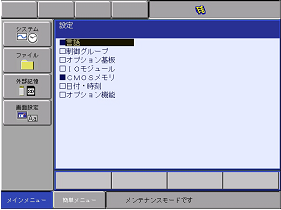
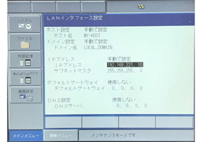
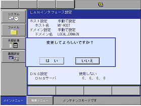
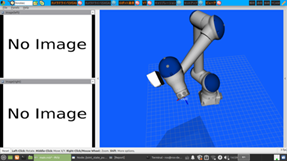

| VTチュートリアル ロボット接続編〜安川電機版 | Revision       | 第2版 |
| ------------------------------------------- | -------------- | ----- |
| 作成者                                      | 株式会社YOODS  |       |
| 作成日                                      | 2020年10月1日  |       |
| 最終更新日                                  | 2023年12月26日 |       |

# 7.  グローバル変数設定

| No   | 手順                                                                                                                                                                                                                                                                                                                                                                | 補足                                                                                                                                                                                                                                                                                                                      |
| ---- | ------------------------------------------------------------------------------------------------------------------------------------------------------------------------------------------------------------------------------------------------------------------------------------------------------------------------------------------------------------------- | ------------------------------------------------------------------------------------------------------------------------------------------------------------------------------------------------------------------------------------------------------------------------------------------------------------------------- |
| A140 | TPで変数→I変数(整数型)を 選択してください。                                                                                                                                                                                                                                                                                                                   | 別紙「ロボットグローバル変数表」を参照して 作業を進めてください。                                                                                                                                                                                                                                                    |
| A141 | I 081〜I 086に右記の数値を 設定してください。     このアドレスが有効になるのは  再起動以降です。     ※A114で設定したPCのIPアドレスを  　入力してください。                                                                                                                                                                      | 番号　入力する数値　　　説明 081　　11000 　　　　　#ポート番号(軸情報)  082 　　192 　　　　　　#IPアドレス①  083 　　168 　　　　　   #IPアドレス②  084 　　221 　　　　　   #IPアドレス③  085　　 2 　　　　　　　#IPアドレス④  086 　　3333 　　　　　 #ポート番号(VTコマンド) |
| A142 | I 087はショートカットキーでカメラ処理を 行うための汎用出力を割り当てる設定です。     右図の②を確認し、5桁の数値を 入力してください。  ※ショートカットキーを使用しない場合も  空いている汎用出力番号を確認して  設定してください。  すでに使用している出力番号とかぶると  正しくON,OFF出来なくなります。    | ① 汎用出力番号 ② I変数(I 087)へ設定する５桁の数値                                                                                          |
| A143 | I 088はリトライ機能を使用する場合に 設定してください。     使用しない場合は「１」を設定。  使用する場合は「２以上」を設定してください。                                                                                                                                                                                                         | リトライ機能は撮影後に 設定した回数、解析のみを行います。  １回目で解析結果OKが出れば  その時点で解析は終了し、  それ以上解析は行いません。  NGが出た場合はOKが出るまで、  または、設定回数到達まで解析を行います。                                                                         |
| A144 | TPで変数→B変数(バイト型)を 選択してください。                                                                                                                                                                                                                                                                                                                 |                                                                                                                                                                                                                                                                                                                           |
| A145 | B 076はペンダントからショートカットキーで カメラ処理を実行できるようにするものです。    使用しない場合は「0」を、  使用する場合は「1」を設定してください。                                                                                                                                                                                 | 設定するとリセット、撮影をショートカットキーで 実行できます。                                                                                                                                                                                                                                                        |
| A146 | ショートカットキー設定方法    「コントローラ設定」→「用途キー割付」を  選択してください。                                                                                                                                                                                                                                                           | セキュリティを「管理モード」にしてください。                                                                                                                                                                                                                                                                              |
| A147 | 上部メニューの「表示」を押して 「単独割付」から「同時押し割付」に  切り替えてください。                                                                                                                                                                                                                                                                   |                                                                                                                                                                                                                                                                                                                           |
| A148 | 使用したいキーを選択して 「メーカー割付」から「モーメンタリィ出力割付」に  切り替えてください。                                                                                                                                                                                                                                                           | ・モーメンタリィ 　ボタンを押している間だけONになる  ・オルタネイト  　ボタンを押した後、手を離してもONを保持する                                                                                                                                                                                          |
| 149  | 設定が正しくできていれば 「インタロックボタン＋割付したボタン」で  リセット、撮影を実行できます。                                                                                                                                                                                                                                                    | 汎用出力画面を開いた状態で  ボタンを押して確認してください。                                                                                                                                                                                                                                                         |

# 8.ロボットに必要なソフトウェアをインストール

| No   | 手順                                                                                                                                                                                                                                          | 確認方法                                                                                                                                                                                                                                                                                                                     |
| ---- | --------------------------------------------------------------------------------------------------------------------------------------------------------------------------------------------------------------------------------------------- | ---------------------------------------------------------------------------------------------------------------------------------------------------------------------------------------------------------------------------------------------------------------------------------------------------------------------------- |
| A150 | PCデスクトップ「VTマニュアル」のリンクを選択して ダブルクリックしてください。     使用するロボットメーカーのフォルダを開き  「Robot_program」のフォルダを開いてください。                                                 | ロボットへ必要なプログラムファイルを移行します。    TPのUSB差し込み口は  ロボットメーカー取扱い説明書を参照してください。                                                                                                                                                                                     |
| A151 | PCへUSBメモリを挿してください。    選択したフォルダ内のファイルを  全てUSBへコピーしてください。     コピー完了後、USBを抜いてください。                                                                             | USBメモリフォルダは自動で出てきますが 出ない場合、ファイルマネージャーを開いて  デバイス内のUSBフォルダを開いてください。     USBを抜く際は、ファイルマネージャー左側メニュー デバイス内にあるUSBの マークを押してから抜いてください。 |
| A152 | TPへUSBメモリを挿してください。 TP画面の「外部記憶」を選択します。  デバイスがUSB:ペンダントか確認し、  USB内のファイルをTPへロードしてください。     完了後、USBメモリを抜いてください。                            | ロードするプログラム ●CLEAR_POS  ●RESET_UF_L  ●ROVI_CAPTURE  ●ROVI_RECIPE  ●ROVI_RESET  ●ROVI_SOLVE  ●VT_MAIN_SAMPLE  ●R_CAL_SAMPLE                                                                                                                                          |
| A153 | 次にMotoPlusで使用するプログラムを ロードします。                                                                                                                                                                                             |                                                                                                                                                                                                                                                                                                                              |
| A154 | ロボットコントローラをメンテナンスモードで起動。   TPの「メインメニュー」ボタンを押しながら YRC1000microを起動(電源投入)。  メンテナンスモードで起動します。                                                                   |                                                                                                                                                                                                                                                                      |
| A155 | 「MotoPlusアプリ」→「ロード」を開きます  「VT.out」を選択し、エンタを押します。                                                                                                                                                    | セキュリティを「管理モード」にしてください。                                                                                                                                                                                                                                                                                 |
| A156 | 再度電源再投入し、  ロボットコントローラを通常モードで起動。  「MotoPlusアプリ」→「MotoPlusモニタ」を選択  アプリケーション起動順序設定を開き、VT.outが  有効アプリケーションに設定されているか  確認してください。 | 無効アプリケーションになっている場合は、  ファイル選択後、「追加」を押して  「設定書込み」を押した後、電源再投入をしてください。                                                                                                                                                                                   |

# 9.  TPでのIPアドレス設定 (YRC1000micro)

| No   | 手順                                                                                                                                                                                                                  | 補足                                                                                                                                         |
| ---- | --------------------------------------------------------------------------------------------------------------------------------------------------------------------------------------------------------------------- | -------------------------------------------------------------------------------------------------------------------------------------------- |
| A160 | ロボットのIPアドレスを設定します。 ロボットコントローラメンテナンスモードで起動    TPの「メインメニュー」ボタンを押しながら YRC1000microを起動(電源投入)。  メンテナンスモードで起動します。 |                                                                                      |
| A161 | システム→セキュリティを選択して、 「管理モード」に変更してください。                                                                                                                                            |                                                                                      |
| A162 | 「システム」→「設定」→「オプション機能」を 選択してください。                                                                                                                                                  |                                                                                      |
| A163 | 「LANインターフェイス設定」を選択してください。                                                                                                                                                                       |  |
| A164 | IPアドレスを設定してください。 標準の設定アドレスは  192.168.221.10です。                                                                                                                                   |                                                                                      |
| A165 | IPアドレスを設定して[Enter]を押すと 右図のように確認ダイアログが表示されます。  「はい」を選択して電源を再投入してください。  通常モードでロボットが起動します。                                       |                                                                                      |
| A166 | 以上でロボットのIPアドレスの設定は完了です。                                                                                                                                                                          |                                                                                                                                              |

# 10.位置変数（P変数）とユーザ座標の設定

| No   | 手順                                                                                                                                                                                                  | 補足                                                                                                                     |
| ---- | ----------------------------------------------------------------------------------------------------------------------------------------------------------------------------------------------------- | ------------------------------------------------------------------------------------------------------------------------ |
| A171 | TPで変数→P変数(位置型)を 選択してください。                                                                                                                                                     |                                                                                                                          |
| A172 | 使用する変数番号のページを開いてください。 デフォルトは「#P090」です。     「＊＊＊＊＊＊＊＊＊＊＊＊」部分を選んで  「ベース」を選択してください。                               | このページに補正量が格納されます。                                                                                       |
| A173 | 続いて、ユーザ座標を設定します。 メインメニューの「ロボット」→「ユーザ座標」を  選択してください。                                                                                         |                                                                                                                          |
| A174 | 使用する番号にカーソルを合わせ 上部メニューの「表示」を選択し、  「座標値」を押してください。                                                                                               | このページに位置変数の値を格納します。 再教示の際は、数値が全て「０」になっている事を 確認してから教示を行ってください。 |
| A175 | ロボットの欄を選んで 使用するロボットを選択してください。  「R1:ﾛﾎﾞｯﾄ1」                                                                                                               |                                                                                                                          |
| A176 | ロボットを選択すると画面下部に 「反映」ボタンが出てきます。  反映を選択した後、「表示」を押して  「一覧」画面に戻ってください。  設定欄が黒丸に変わっていれば設定完了です。  | 数値は全て「０」のまま反映を押してください。  再教示の時はこの数値が全て「０」の状態で  行ってください。       |
| A177 | 設定した位置変数、ユーザ座標の番号は  プログラム作成時に必要となります。                                                                                                                    |                                                                                                                          |

# [11.      動作確認]()

| No   | 手順                                                                                                                                         | 確認方法                                                                                                                                                                                                                                                         |
| ---- | -------------------------------------------------------------------------------------------------------------------------------------------- | ---------------------------------------------------------------------------------------------------------------------------------------------------------------------------------------------------------------------------------------------------------------- |
| A180 | デスクトップのVT起動アイコンを ダブルクリックして、ビジュアルコントローラを  起動します。  ※起動済みの場合は、念のため再起動 |                                                                VT起動アイコン |
| A181 | ご使用のロボットが画面に表示されることを 確認します。                                                                                   |  画面上にロボットが表示されます。                                                                                                                                                                   |
| A182 | TPでロボットを動かし、画面上のロボットと 実際のロボットの動きが連動していることを  確認してください。                              | 各軸座標系で6軸それぞれを動かし 連動しているか確認してください。                                                                                                                                                                                            |

**改定履歴**

| #     | 日付             | 内容     |
| ----- | ---------------- | -------- |
| 初版  | 2020年 10月 1日  |          |
| 第2版 | 2023年 12月 26日 | 誤字修正 |
